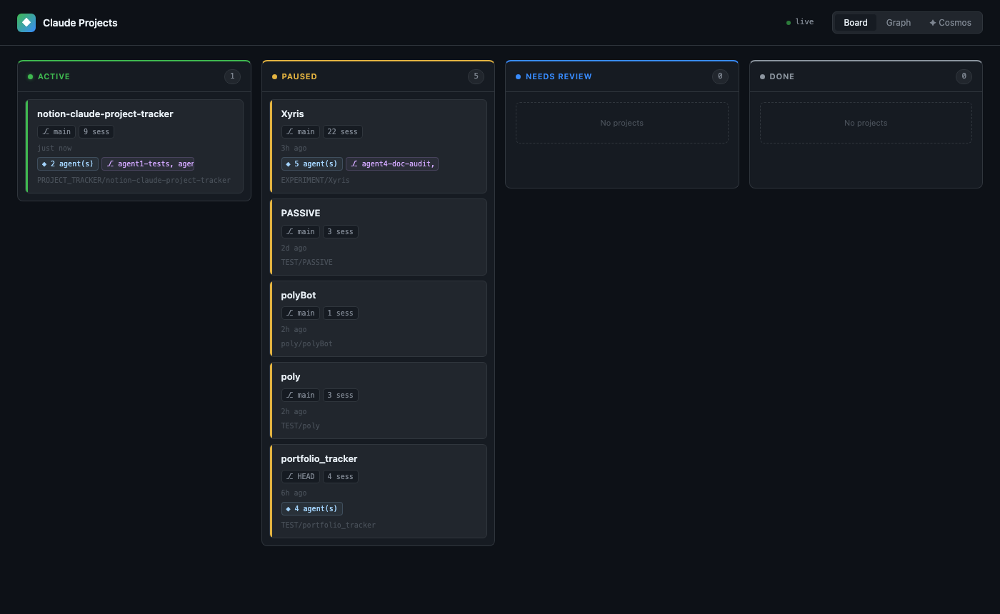
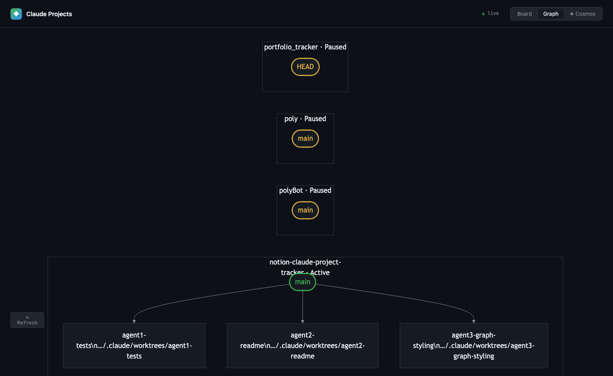
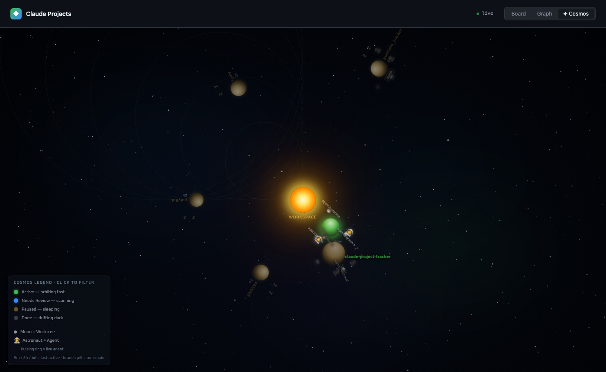

# Notion Claude Project Tracker

[](LICENSE)
[](package.json)

A real-time dashboard that syncs your local Claude Code project sessions into a Notion Kanban board and a live browser UI with **Board**, **Graph**, and **Cosmos** views.

---

## Screenshots

### Board — Kanban view


### Graph — Dependency & agent flowchart


### Cosmos — Animated galaxy view


---

## Features

### Board tab
- Four-column Kanban: **Active**, **Paused**, **Needs Review**, **Done**
- Drag cards between Paused / Needs Review / Done columns to update status
- Live SSE updates — cards reflect session state as it changes
- Shows git branch, session count, last-active time, agent count, and worktrees per card

### Graph tab
- Mermaid flowchart of all projects with their git worktrees and live agent teams
- Status-aware color coding: green = active, yellow = idle/paused, grey = done
- Model labels on agent nodes
- Refresh button to re-render on demand

### Cosmos tab
A deep-space telemetry HUD where each project is a **planet orbiting a central star**.

| Visual | Meaning |
|--------|---------|
| Planet size | Session count (more sessions → bigger planet) |
| Planet color | Status — green (Active), blue (Needs Review), amber (Paused), grey (Done) |
| Orbit speed | Active = fast (20 s), Needs Review = medium (36 s), Done = slow drift (100 s), Paused = frozen |
| Moons | Git worktrees orbiting the planet |
| Astronaut emoji | Active agents floating near the planet |
| Pulsing beacon rings | Live agents with `status === active` — rings radiate outward like sonar |
| `5m` / `2h` / `4d` label | Time since last session (`last_session`) |
| Branch pill | Non-main git branch name |
| **Click planet** | Zoom to focused view — left panel shows project details, right panel lists all agents and worktrees |
| **Click legend item** | Toggle that status class in/out of view (orbit ring stays; planet hides) |
| **Hover planet** | Popup showing status, branch, sessions, last active, agent activity, last commit |

**Font:** [Oxanium](https://fonts.google.com/specimen/Oxanium) (Google Fonts) — applied to all Cosmos-specific text for a distinct sci-fi identity.

### Auto-sync
- Claude Code hooks flip project status to **Active** on session start and **Paused** on stop
- Notion database stays in sync — full project metadata pushed on each session

---

## Prerequisites

- **macOS or Linux** with `bash` (≥ 3.2), `curl`, and `jq`
- **Node.js** ≥ 18
- **Claude Code** installed (`~/.claude/` directory exists)
- **Notion** account with an [integration token](https://www.notion.so/my-integrations) that has write access to your workspace
- A Notion page to host the database (you'll need its page ID)

---

## Setup

### 1. Clone the repo

```bash
git clone <this-repo-url>
cd notion-claude-project-tracker
```

### 2. Configure credentials

```bash
cp .env.example .env
```

Edit `.env` and fill in:

```bash
NOTION_TOKEN=secret_xxxxxxxxxxxxxxxxxxxxxxxxxxxx
NOTION_PARENT_PAGE_ID=xxxxxxxxxxxxxxxxxxxxxxxxxxxxxxxx
```

**How to get these values:**
- `NOTION_TOKEN`: Create an integration at https://www.notion.so/my-integrations → copy the "Internal Integration Secret"
- `NOTION_PARENT_PAGE_ID`: Open your target Notion page → copy the 32-character ID from the URL (e.g. `https://notion.so/My-Page-abc123def456...` → ID is `abc123def456...`)
- Make sure to **share the Notion page** with your integration (click "Share" → invite the integration)

### 3. Run setup

```bash
bash setup.sh
```

This will:
1. Validate your environment variables and Node.js installation
2. Create the "Claude Projects" Kanban database in Notion
3. Start the local server on port 7842

Open **http://localhost:7842** to see your dashboard.

---

## Daily Usage

### Automatic (hooks)

Register the hooks in `~/.claude/settings.json` so Claude Code fires them on every session:

```json
{
  "hooks": {
    "SessionStart": [{ "type": "command", "command": "bash /path/to/hooks/session-start.sh" }],
    "Stop":         [{ "type": "command", "command": "bash /path/to/hooks/session-stop.sh"   }]
  }
}
```

Once registered:
- **Session starts** → card flips to **Active**, Notion record updated
- **Session ends/stops** → card flips to **Paused**, Notion record updated

### Manual sync

Run a full rescan at any time:

```bash
./bin/sync-notion
```

### Marking projects as "Needs Review" or "Done"

These statuses are set **manually** — drag the card on the Board tab, or edit the Status field directly in Notion. `sync-notion` only writes Active/Paused based on session activity.

---

## Development

```bash
# Start the server
npm start          # or: node lib/server.js

# Run tests
npm test           # or: node tests/graph.test.js
```

---

## Project Structure

```
notion-claude-project-tracker/
├── bin/
│   ├── serve                # Start the local HTTP server
│   └── sync-notion          # Notion sync CLI (executable)
├── docs/
│   └── screenshots/         # UI screenshots used in this README
├── hooks/
│   ├── session-start.sh     # Claude Code SessionStart hook → Active
│   └── session-stop.sh      # Claude Code Stop hook → Paused
├── lib/
│   ├── config.sh            # Load .env, set defaults
│   ├── graph.js             # Mermaid DSL builder (Graph tab)
│   └── server.js            # HTTP server + SSE + API routes
├── tests/
│   └── graph.test.js        # Unit tests for graph.js
├── web/
│   └── index.html           # Browser UI (Board, Graph, Cosmos tabs)
├── setup.sh                 # One-time setup: validate env + start server
├── .env.example             # Credentials template
├── package.json
└── README.md
```

---

## Notion Database Schema

| Property       | Type   | Values / Notes                          |
|----------------|--------|-----------------------------------------|
| Name           | title  | Project directory name                  |
| Status         | select | Active, Paused, Needs Review, Done      |
| Local Path     | text   | Full filesystem path                    |
| Git Branch     | text   | From latest session's git branch        |
| Last Session   | date   | Most recent `.jsonl` file mtime         |
| Session Count  | number | Total `.jsonl` files in project dir     |
| Session ID     | text   | Latest session UUID (used by hooks)     |
| Agents         | text   | Agent count string from session data    |
| Worktrees      | text   | Comma-separated worktree paths          |
| Last Commit    | text   | Most recent commit message              |

---

## Troubleshooting

**`sync-notion` exits with "No Notion database found"**
Run `bash setup.sh` first to create the database and write `.notion-db-id`.

**Cards not updating on session start/stop**
Check that `~/.claude/settings.json` contains entries for both hooks and that the paths are absolute.

**"ERROR: NOTION_TOKEN is not set"**
Make sure `.env` exists and contains your token. Run `cp .env.example .env` and fill it in.

**`jq` not found**
Install with `brew install jq` (macOS) or `apt install jq` (Ubuntu/Debian).

**Cosmos tab shows no planets**
The Cosmos tab requires an active SSE connection. Check that the server is running (`npm start`) and the header shows "live".

---

## Uninstalling Hooks

Edit `~/.claude/settings.json` and remove the entries referencing `session-start.sh` and `session-stop.sh` from the `hooks.SessionStart` and `hooks.Stop` arrays.

---

## Third-Party Licenses

This project uses the following third-party resources:

| Resource | License | Notes |
|----------|---------|-------|
| [Mermaid](https://github.com/mermaid-js/mermaid) | MIT | Bundled at `web/mermaid.min.js` for Graph tab rendering |
| [Oxanium](https://fonts.google.com/specimen/Oxanium) (Google Fonts) | [OFL-1.1](https://scripts.sil.org/OFL) | Loaded via CDN for Cosmos tab typography |

---

## Contributing

See [CONTRIBUTING.md](CONTRIBUTING.md).

## License

[MIT](LICENSE) © 2026 notion-claude-project-tracker contributors
